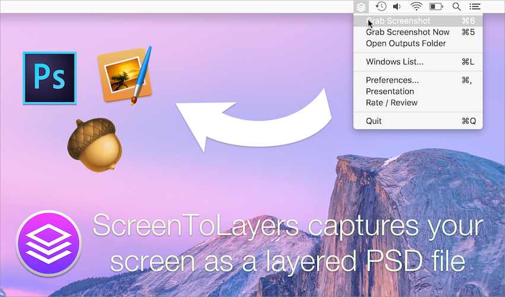

# ScreenToLayers for macOS

## Introduction

**ScreenToLayers** is a macOS application to easily capture your screen as a layered PSD file. This idea is not mine and comes from a great application named [ScreenShot PSD](https://itunes.apple.com/us/app/screenshot-psd/id489880259?ls=1&mt=12). However the app is not optimized for El capitan and doesn't support retina screen. That is why I made my own open source alternative.

The actual version is very simple and only meets my own requirements. However, I look forward about new features and contribution from the community (programmers and designers).

The application uses some not very well-known APIs. If you want to register your application at startup or if you need to create a persistent file access due to the sandboxing of the AppStore, some code portions will help you to understand how to.

## Installation

The simplest way to get the latest release of **ScreenToLayers** is to download the application through the [Mac AppStore](https://itunes.apple.com/us/app/screentolayers/id1077317077?ls=1&amp;mt=8). The application is totally free and it is updated when major changes are made.

## Compilation

The application was compiled and tested with Xcode 7 on Mac Sierra. The project requires macOS 10.10 and used ARC and Cocoa.

To compile, you only have to open `ScreenToLayers.xcodeproj` and run.

## Contribution

If you have ideas or if you found bugs, I encourage you to open a pull-issue.

If you are a developer and/or a designer, you can also contribute to the project by submitting pull-requests on the dev branch. The application was written in Objective-C to simplify the use of the low level API. I don't want to mix Objective-C and Swift for small project like this one. Please try to follow this rule and keep the actual guide style.

## About

My name is Jeremy Vizzini and you can read more about me on [jeremyvizzini.com](http://jeremyvizzini.com).

## References

* Application website : [here](http://screentolayersapp.com)
* Mac AppStore page : [here](https://github.com/jeremyvizzini/ScreenToLayers)
* Apple sample demonstrating the CGWindow API : [Sample](https://developer.apple.com/library/prerelease/content/samplecode/SonOfGrab/Introduction/Intro.html).

## License

ScreenToLayers is released under a MIT license. See the LICENSE file for more information.
